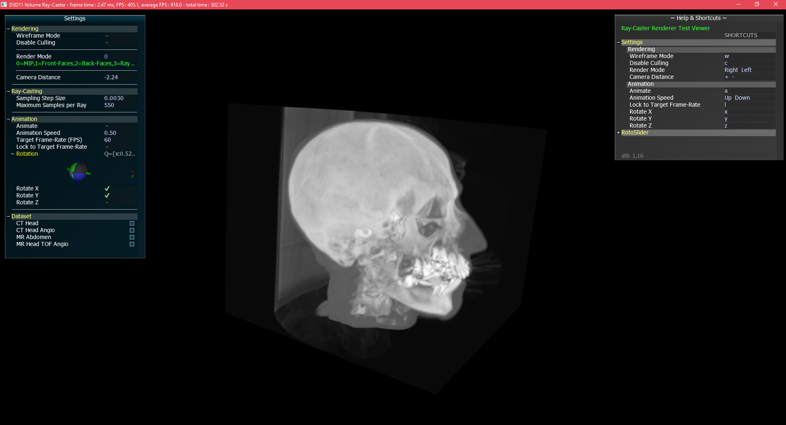
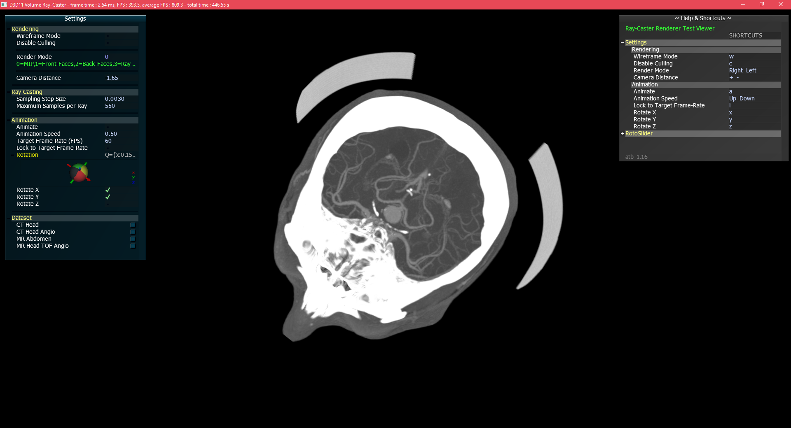
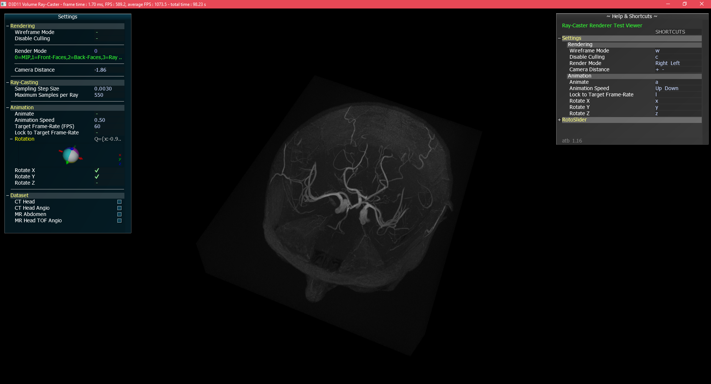
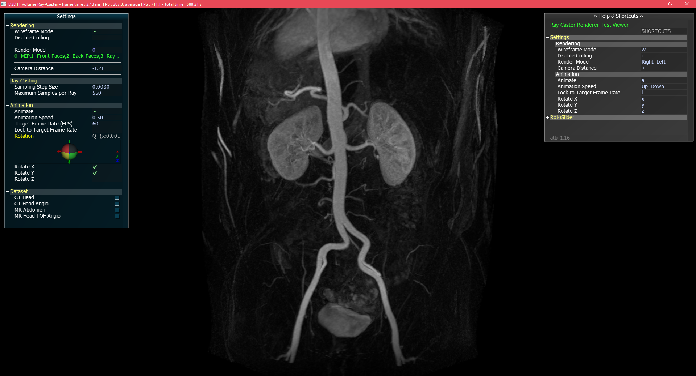

# D3DVolumeRaycaster
Volume Raycaster for **3D MIP** Rendering of **MRI** and **CT** volume datasets implemented in C++ and Direct3D 11.

MIP stands for **M**aximum **I**ntensity **P**rojection, which means the projection of voxels of a 3D volume dataset with maximum intensity to a 2D image. It is a method in the medical imaging domain and is very often applied in MRI or CT angiography examinations.

The repository contains four demo datasets, 2 x CT and 2 x MRI (only pixel data, 8 bit resolution - no DICOM dataset) to be able to start immediately to figure out how volume raycasting works.

## Screenshots of the demo datasets

### CT Head, columns : 256, rows : 256, slices : 225

### CT Head Angio, columns : 512, rows : 512, slices : 79

### MRI Head TOF Angio, columns : 416, rows : 512, slices : 112

### MRI Abdomen Angio, columns : 384, rows : 512, slices : 80

